# All Diagrams

Browser-rendered gallery: [index.html](index.html).

Supporting docs:
- [Diagram Index](diagram_index.md)
- [Hardware/Software Interface](hardware_software_interface.md)
- [Register Map](register_map.md)
- [Source Traceability](source_traceability.md)
- [Final Breakdown](../final_breakdown.md)
- [File Listings](../file_listings.md)

## C Call Graph

Source: [c_call_graph.mmd](c_call_graph.mmd)

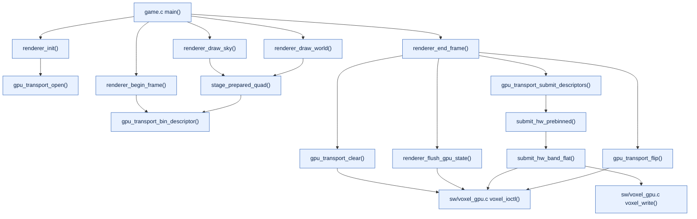

## Full System Architecture

Source: [full_system_architecture.mmd](full_system_architecture.mmd)

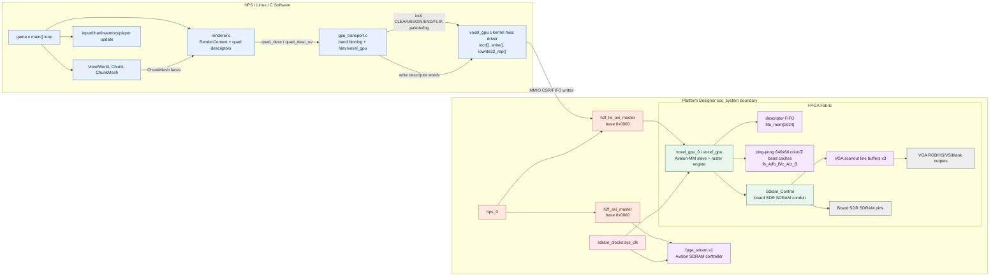

## Game-to-Pixels Flow

Source: [game_to_pixels_flow.mmd](game_to_pixels_flow.mmd)


## HPS/FPGA Ownership

Source: [hps_fpga_ownership.mmd](hps_fpga_ownership.mmd)

```mermaid
%% Generated from RTL/C/Platform Designer source. Do not hand-edit generated diagrams.
%% Regenerate with: make diagrams
flowchart LR
subgraph HPS["HPS-owned state and work"]
  world["VoxelWorld<br/>chunks, blocks, lighting, redstone, falling blocks"]:::hps
  mesh["ChunkMesh snapshots<br/>atomic live_mesh"]:::hps
  renderbuf["RenderContext submit_buffer<br/>quad_desc stream"]:::hps
  bins["gpu_transport per-band bins<br/>g_bins_pool[2][8]"]:::hps
  kdrv["Kernel driver bounce buffer<br/>VOXEL_BOUNCE_WORDS=2048"]:::hps
end
subgraph CROSS["Boundary crossings"]
  ioctls["ioctl ABI<br/>CLEAR, BEGIN_BAND, END_BAND, FLIP, SET_*"]:::bus
  writes["write() descriptor stream<br/>32-bit FIFO words"]:::bus
  regs["Avalon-MM CSR window<br/>0x0000..0x006C + FIFO 0x1000..0x1FFF"]:::reg
end
subgraph FPGA["FPGA-owned state and work"]
  csr["voxel_gpu CSRs<br/>control/status/palette/fog/band/extmem/perf"]:::reg
  fifo["fifo_mem[1024] descriptor FIFO"]:::mem
  pipe["voxel_gpu raster pipeline<br/>pipe0..commit"]:::fpga
  tex["texture ROM + reciprocal LUT + palettes"]:::mem
  cache["color/Z ping-pong band caches"]:::mem
  ext["external SDRAM color/Z frames"]:::mem
  scan["VGA counters + scanout line buffers"]:::fpga
end
world --> mesh --> renderbuf --> bins --> writes --> fifo --> pipe
bins --> ioctls --> csr
kdrv --> regs --> csr
pipe --> tex
pipe --> cache --> ext --> scan

classDef hps fill:#e8f1ff,stroke:#2f63b8,stroke-width:1px,color:#0d2448;
classDef fpga fill:#e9f7ef,stroke:#2a7a45,stroke-width:1px,color:#0d341c;
classDef reg fill:#fff3cc,stroke:#b98500,stroke-width:1px,color:#3d2c00;
classDef mem fill:#f4e9ff,stroke:#6e3fa0,stroke-width:1px,color:#2d124a;
classDef bus fill:#ffe8df,stroke:#b55632,stroke-width:1px,color:#4a1f0b;
classDef ctrl fill:#ffe9ef,stroke:#b83a58,stroke-width:1px,color:#4a0d1b;
classDef math fill:#e6fbff,stroke:#247a91,stroke-width:1px,color:#09313d;
classDef out fill:#eeeeee,stroke:#555555,stroke-width:1px,color:#222222;
```

## HPS Software Architecture

Source: [hps_software_architecture.mmd](hps_software_architecture.mmd)

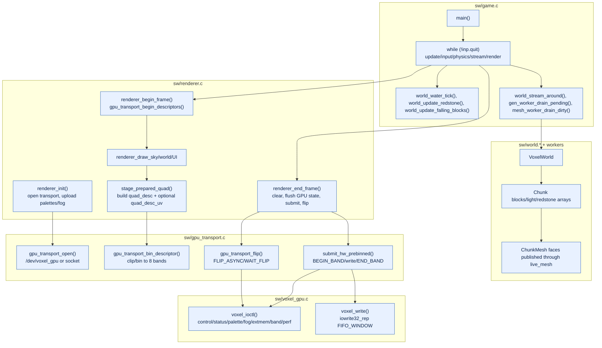

## HPS-to-FPGA Dataflow

Source: [hps_to_fpga_dataflow.mmd](hps_to_fpga_dataflow.mmd)

```mermaid
%% Generated from RTL/C/Platform Designer source. Do not hand-edit generated diagrams.
%% Regenerate with: make diagrams
flowchart LR
world["VoxelWorld / ChunkMesh<br/>sw/world.h, sw/world.c"]:::hps
render["renderer.c<br/>project faces, build quad_desc"]:::hps
stage["stage_prepared_quad()<br/>64B base + 36B UV extension if textured"]:::hps
bin["gpu_transport.c<br/>bin_one_descriptor() by 60-line band"]:::hps
begin["VOXEL_IOC_BEGIN_BAND<br/>BAND_INDEX + BAND_WINDOW + BEGIN"]:::bus
stream["write() descriptor bytes<br/>kernel voxel_write()"]:::bus
endband["VOXEL_IOC_END_BAND<br/>BAND_CTRL.FLUSH"]:::bus
flip["VOXEL_IOC_FLIP_ASYNC/WAIT_FLIP<br/>CONTROL.FLP + STATUS.VSY"]:::bus
csr["voxel_gpu CSR writes"]:::reg
fifo["FIFO window 0x1000..0x1FFF<br/>fifo_mem[1024]"]:::mem
fetch["ST_FETCH desc_words[]"]:::fpga
setup["ST_SETUP raster_setup"]:::math
draw["ST_DRAW pipeline"]:::fpga
cache["640x60 band color/Z cache"]:::mem
sdram["inactive SDRAM frame"]:::mem
scan["VGA scanout active SDRAM frame"]:::out
world --> render --> stage --> bin
bin --> begin --> csr
bin --> stream --> fifo --> fetch --> setup --> draw --> cache
bin --> endband --> csr --> cache --> sdram
bin --> flip --> csr --> scan
sdram --> scan

classDef hps fill:#e8f1ff,stroke:#2f63b8,stroke-width:1px,color:#0d2448;
classDef fpga fill:#e9f7ef,stroke:#2a7a45,stroke-width:1px,color:#0d341c;
classDef reg fill:#fff3cc,stroke:#b98500,stroke-width:1px,color:#3d2c00;
classDef mem fill:#f4e9ff,stroke:#6e3fa0,stroke-width:1px,color:#2d124a;
classDef bus fill:#ffe8df,stroke:#b55632,stroke-width:1px,color:#4a1f0b;
classDef ctrl fill:#ffe9ef,stroke:#b83a58,stroke-width:1px,color:#4a0d1b;
classDef math fill:#e6fbff,stroke:#247a91,stroke-width:1px,color:#09313d;
classDef out fill:#eeeeee,stroke:#555555,stroke-width:1px,color:#222222;
```

## Memory and Buffer Ownership

Source: [memory_and_buffer_ownership.mmd](memory_and_buffer_ownership.mmd)

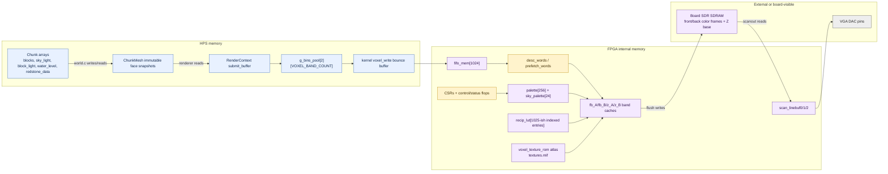

## Register Interface Flow

Source: [register_interface_flow.mmd](register_interface_flow.mmd)

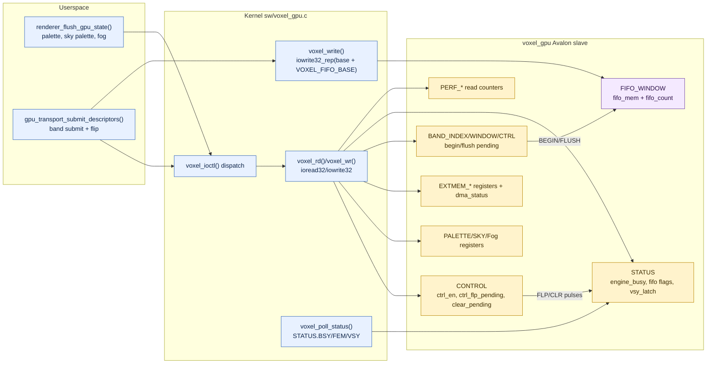

## soc_system Context

Source: [soc_system_context.mmd](soc_system_context.mmd)

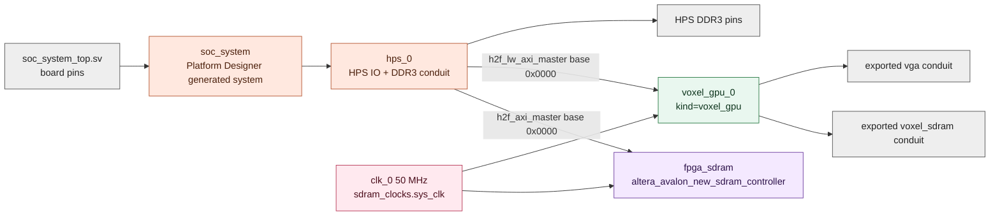

## voxel_gpu Control FSM

Source: [voxel_gpu_control_fsm.mmd](voxel_gpu_control_fsm.mmd)

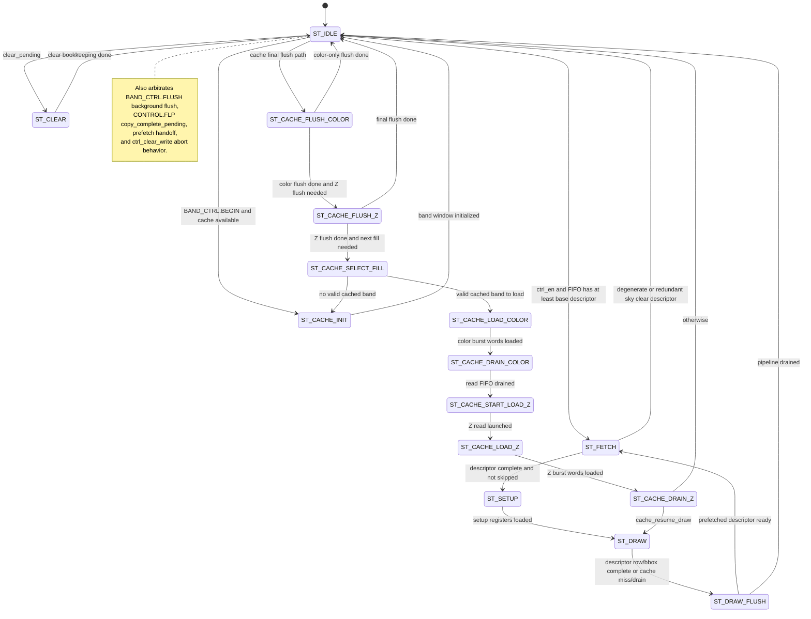

## voxel_gpu Datapath

Source: [voxel_gpu_datapath.mmd](voxel_gpu_datapath.mmd)

```mermaid
%% Generated from RTL/C/Platform Designer source. Do not hand-edit generated diagrams.
%% Regenerate with: make diagrams
flowchart LR
subgraph FRONT["Avalon-MM front door"]
  csr["CSRs<br/>control/status/palette/fog/extmem/band/perf"]:::reg
  fifo["FIFO_WINDOW writes<br/>fifo_mem[1024]"]:::mem
end
subgraph DESC["Descriptor fetch/setup"]
  fetch["ST_FETCH<br/>desc_words[0..24]"]:::fpga
  unpack["desc_* wires<br/>bbox, edges, z, flags, UV planes"]:::fpga
  setup["voxel_raster_setup<br/>MUL edge A*x/B*y, ADD C, setup z/UV/IW"]:::math
end
subgraph DRAW["2-pixel raster walk"]
  step["voxel_draw_step<br/>edge ADD, z/UV/IW ADD, next pair/row"]:::math
  inside["edge comparators<br/>inside lane0/lane1"]:::math
  zrd["color/Z cache read<br/>fb_draw_rd_data, z_draw_rd_data"]:::mem
end
subgraph PIPE["Pixel pipeline"]
  pipe0["pipe0 regs<br/>addr/z/uv/iw/flags"]:::reg
  recip["recip stages<br/>normalize, LUT, interpolate, denormalize"]:::math
  uv["UV multiply<br/>u_over_w*w, v_over_w*w"]:::math
  tex["texture_coord + voxel_texture_rom"]:::mem
  pal["apply_light_bank + palette/sky palette"]:::mem
  fog["radial distance MUL/ADD + voxel_fog_blend"]:::math
  commit["commit_valid/pass<br/>alpha, z-test comparator, color/Z write"]:::reg
end
subgraph CACHE["Band cache and external frame"]
  band["ping-pong color/Z band caches<br/>640x60"]:::mem
  flush["ST_CACHE_* + background flush<br/>SDRAM write bursts"]:::fpga
  sdram["board SDR SDRAM frames<br/>front/back color + Z base"]:::mem
end
subgraph OUT["Display"]
  scan["scanout line buffers x3<br/>SDRAM read bursts"]:::mem
  vga["VGA RGB + timing"]:::out
end
csr --> fetch
fifo --> fetch --> unpack --> setup --> step --> inside --> pipe0
zrd --> pipe0
pipe0 --> recip --> uv --> tex --> pal --> fog --> commit --> band
band --> flush --> sdram --> scan --> vga

classDef hps fill:#e8f1ff,stroke:#2f63b8,stroke-width:1px,color:#0d2448;
classDef fpga fill:#e9f7ef,stroke:#2a7a45,stroke-width:1px,color:#0d341c;
classDef reg fill:#fff3cc,stroke:#b98500,stroke-width:1px,color:#3d2c00;
classDef mem fill:#f4e9ff,stroke:#6e3fa0,stroke-width:1px,color:#2d124a;
classDef bus fill:#ffe8df,stroke:#b55632,stroke-width:1px,color:#4a1f0b;
classDef ctrl fill:#ffe9ef,stroke:#b83a58,stroke-width:1px,color:#4a0d1b;
classDef math fill:#e6fbff,stroke:#247a91,stroke-width:1px,color:#09313d;
classDef out fill:#eeeeee,stroke:#555555,stroke-width:1px,color:#222222;
```

## voxel_gpu Module Hierarchy

Source: [voxel_gpu_module_hierarchy.mmd](voxel_gpu_module_hierarchy.mmd)

```mermaid
%% Generated from RTL/C/Platform Designer source. Do not hand-edit generated diagrams.
%% Regenerate with: make diagrams
flowchart TB
gpu["voxel_gpu<br/>Avalon slave, FSM, pipeline, SDRAM/VGA arbitration"]:::fpga
front["CSR/FIFO front door<br/>ADDR_* map, fifo_mem"]:::reg
fsm["engine_state_t FSM<br/>ST_IDLE..ST_CACHE_DRAIN_Z"]:::ctrl
setup["voxel_raster_setup<br/>edge/depth/UV initial values"]:::math
drawstep["voxel_draw_step<br/>2-pixel edge/depth/UV stepping"]:::math
recip["voxel_iw_normalize x2<br/>voxel_recip_interpolate x2<br/>voxel_w_denormalize x2"]:::math
fog["voxel_fog_blend x2"]:::math
ram["voxel_banked_sdp_ram x4<br/>fb_back_ram_A/B, z_ram_A/B"]:::mem
texture["voxel_texture_rom<br/>dual read texture atlas"]:::mem
vga["voxel_vga_counters"]:::fpga
sdram["Sdram_Control<br/>WR/RD FIFO interface to board SDRAM"]:::fpga
gpu --> front
gpu --> fsm
gpu --> setup
gpu --> drawstep
gpu --> recip
gpu --> fog
gpu --> ram
gpu --> texture
gpu --> vga
gpu --> sdram
ram -->|"contains"| bank["voxel_sdp_ram banks<br/>vendor altsyncram"]:::mem
texture -->|"uses"| altsyncram["altsyncram ROM copies"]:::mem
sdram -->|"uses"| fifos["Sdram_WR_FIFO / Sdram_RD_FIFO"]:::mem

classDef hps fill:#e8f1ff,stroke:#2f63b8,stroke-width:1px,color:#0d2448;
classDef fpga fill:#e9f7ef,stroke:#2a7a45,stroke-width:1px,color:#0d341c;
classDef reg fill:#fff3cc,stroke:#b98500,stroke-width:1px,color:#3d2c00;
classDef mem fill:#f4e9ff,stroke:#6e3fa0,stroke-width:1px,color:#2d124a;
classDef bus fill:#ffe8df,stroke:#b55632,stroke-width:1px,color:#4a1f0b;
classDef ctrl fill:#ffe9ef,stroke:#b83a58,stroke-width:1px,color:#4a0d1b;
classDef math fill:#e6fbff,stroke:#247a91,stroke-width:1px,color:#09313d;
classDef out fill:#eeeeee,stroke:#555555,stroke-width:1px,color:#222222;
```

## voxel_gpu Pipeline

Source: [voxel_gpu_pipeline.mmd](voxel_gpu_pipeline.mmd)

```mermaid
%% Generated from RTL/C/Platform Designer source. Do not hand-edit generated diagrams.
%% Regenerate with: make diagrams
flowchart LR
subgraph S0["S0 ST_FETCH"]
  s0["desc_words[] registers<br/>FIFO pop, descriptor size 16/25 words"]:::reg
end
subgraph S1["S1 ST_SETUP"]
  s1a["voxel_raster_setup<br/>MUL edge A*x/B*y"]:::math
  s1b["edge_row/cur, z_row/cur,<br/>uw/vw/iw row/cur registers"]:::reg
end
subgraph S2["S2 ST_DRAW issue"]
  s2a["voxel_draw_step<br/>ADD next pair/row"]:::math
  s2b["inside CMP, bbox CMP,<br/>cache address, z clamp"]:::math
  s2c["pipe0 / pipe0_o registers"]:::reg
end
subgraph S3["S3 reciprocal normalize"]
  s3["recip0 registers<br/>iw_msb, iw_norm, cache z/color read alignment"]:::reg
end
subgraph S4["S4 reciprocal LUT"]
  s4["recip1 registers<br/>recip_lut lo/hi, z_ref, dst_rgb565"]:::reg
end
subgraph S5["S5 reciprocal interpolate"]
  s5["recip2 registers<br/>voxel_recip_interpolate"]:::reg
end
subgraph S6["S6 denormalize / UV multiply"]
  s6["pipe1 registers<br/>voxel_w_denormalize + MUL u/v"]:::reg
end
subgraph S7["S7 texture address"]
  s7["tex0 registers<br/>texture_coord, tex_addr"]:::reg
end
subgraph S8["S8 texture ROM latency"]
  s8["pipe2 registers<br/>voxel_texture_rom address"]:::reg
end
subgraph S9["S9 color select"]
  s9["draw_pipe registers<br/>texel or flat color, light bank"]:::reg
end
subgraph S10["S10 palette address"]
  s10["pal_rd registers<br/>palette/sky/fog addresses, z pass"]:::reg
end
subgraph S11["S11 palette data"]
  s11["plr registers<br/>palette RGB + fog RGB"]:::reg
end
subgraph S12["S12 fog setup"]
  s12["fog0 registers<br/>RGB565 + radial distance product"]:::reg
end
subgraph S13["S13 fog blend"]
  s13["fog1 registers<br/>radial_q8_8 + voxel_fog_blend"]:::reg
end
subgraph S14["S14 commit"]
  s14["commit registers<br/>z-test pass, alpha/fog color, color/Z write"]:::reg
end
s0 --> s1a --> s1b --> s2a --> s2b --> s2c --> s3 --> s4 --> s5 --> s6 --> s7 --> s8 --> s9 --> s10 --> s11 --> s12 --> s13 --> s14

classDef hps fill:#e8f1ff,stroke:#2f63b8,stroke-width:1px,color:#0d2448;
classDef fpga fill:#e9f7ef,stroke:#2a7a45,stroke-width:1px,color:#0d341c;
classDef reg fill:#fff3cc,stroke:#b98500,stroke-width:1px,color:#3d2c00;
classDef mem fill:#f4e9ff,stroke:#6e3fa0,stroke-width:1px,color:#2d124a;
classDef bus fill:#ffe8df,stroke:#b55632,stroke-width:1px,color:#4a1f0b;
classDef ctrl fill:#ffe9ef,stroke:#b83a58,stroke-width:1px,color:#4a0d1b;
classDef math fill:#e6fbff,stroke:#247a91,stroke-width:1px,color:#09313d;
classDef out fill:#eeeeee,stroke:#555555,stroke-width:1px,color:#222222;
```

## voxel_gpu Timing WaveDrom

Rendered SVG: [voxel_gpu_timing.svg](voxel_gpu_timing.svg)

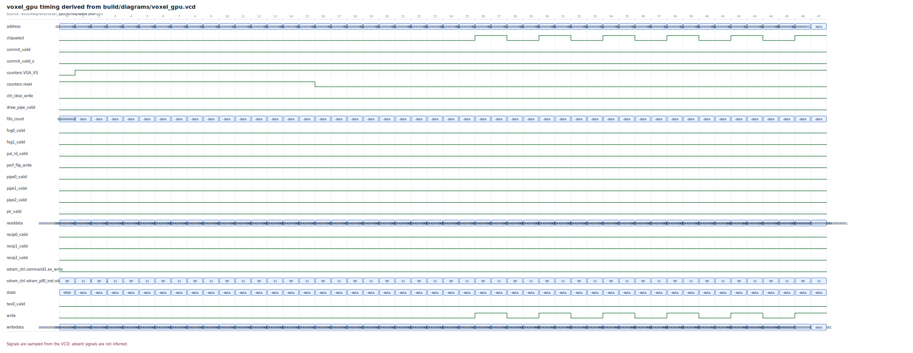

Source: [voxel_gpu_timing.wave.json](voxel_gpu_timing.wave.json)

```json
{
  "head": {
    "text": "voxel_gpu timing derived from build/diagrams/voxel_gpu.vcd"
  },
  "signal": [
    {
      "name": "address",
      "wave": "=.............................=.=.=.=.=.=.=.=.=.",
      "data": [
        "0000000000000",
        "0000000000011",
        "0000000000000",
        "0000000000100",
        "0000000000000",
        "0000000001101",
        "0000000000000",
        "0000000001111",
        "0000000000000",
        "0000000001110"
      ]
    },
    {
      "name": "chipselect",
      "wave": "0.........................1.0.1.0.1.0.1.0.1.0.1."
    },
    {
      "name": "commit_valid",
      "wave": "0..............................................."
    },
    {
      "name": "commit_valid_o",
      "wave": "0..............................................."
    },
    {
      "name": "counters.VGA_VS",
      "wave": "01.............................................."
    },
    {
      "name": "counters.reset",
      "wave": "1...............0..............................."
    },
    {
      "name": "ctrl_clear_write",
      "wave": "0..............................................."
    },
    {
      "name": "draw_pipe_valid",
      "wave": "0..............................................."
    },
    {
      "name": "fifo_count",
      "wave": "=...............................................",
      "data": [
        "00000000000"
      ]
    },
    {
      "name": "fog0_valid",
      "wave": "0..............................................."
    },
    {
      "name": "fog1_valid",
      "wave": "0..............................................."
    },
    {
      "name": "pal_rd_valid",
      "wave": "0..............................................."
    },
    {
      "name": "perf_flip_write",
      "wave": "0..............................................."
    },
    {
      "name": "pipe0_valid",
      "wave": "0..............................................."
    },
    {
      "name": "pipe1_valid",
      "wave": "0..............................................."
    },
    {
      "name": "pipe2_valid",
      "wave": "0..............................................."
    },
    {
      "name": "plr_valid",
      "wave": "0..............................................."
    },
    {
      "name": "readdata",
      "wave": "=..........................=..=.=.=.=.=.=.=.=.==",
      "data": [
        "00000000000000000000000000000000",
        "00000000000000000000000000000001",
        "00000000000000000000000000000000",
        "00000000000000000000000000000001",
        "00000000000000000000000000000000",
        "00000000000000000000000000000001",
        "00000000000000000000000000000000",
        "00000000000000000000000000000001",
        "00000000000000000011101100000000",
        "00000000000000000000000000000001",
        "00000000000000000000000000000000",
        "00000000000000000000000000000001"
      ]
    },
    {
      "name": "recip0_valid",
      "wave": "0..............................................."
    },
    {
      "name": "recip1_valid",
      "wave": "0..............................................."
    },
    {
      "name": "recip2_valid",
      "wave": "0..............................................."
    },
    {
      "name": "sdram_ctrl.command1.ex_write",
      "wave": "0..............................................."
    },
    {
      "name": "sdram_ctrl.sdram_pll0_inst.sdram_pll0_inst.altera_pll_i.outclk",
      "wave": "================================================",
      "data": [
        "00",
        "11",
        "00",
        "11",
        "00",
        "11",
        "00",
        "11",
        "00",
        "11",
        "00",
        "11",
        "00",
        "11",
        "00",
        "11",
        "00",
        "11",
        "00",
        "11",
        "00",
        "11",
        "00",
        "11",
        "00",
        "11",
        "00",
        "11",
        "00",
        "11",
        "00",
        "11",
        "00",
        "11",
        "00",
        "11",
        "00",
        "11",
        "00",
        "11",
        "00",
        "11",
        "00",
        "11",
        "00",
        "11",
        "00",
        "11"
      ]
    },
    {
      "name": "state",
      "wave": "=...............................................",
      "data": [
        "0000"
      ]
    },
    {
      "name": "tex0_valid",
      "wave": "0..............................................."
    },
    {
      "name": "write",
      "wave": "0.........................1.0.1.0.1.0.1.0.1.0.1."
    },
    {
      "name": "writedata",
      "wave": "=.........................=.=.............=.=.=.",
      "data": [
        "00000000000000000000000000000000",
        "00000000000000000000000000000001",
        "00000000000000000000000000000000",
        "00000000000000000011101100000000",
        "00000000000000000000000000000000",
        "00000000000000000000000000000001"
      ]
    }
  ],
  "foot": {
    "text": "Signals are sampled from the VCD; absent signals are not inferred."
  }
}
```
